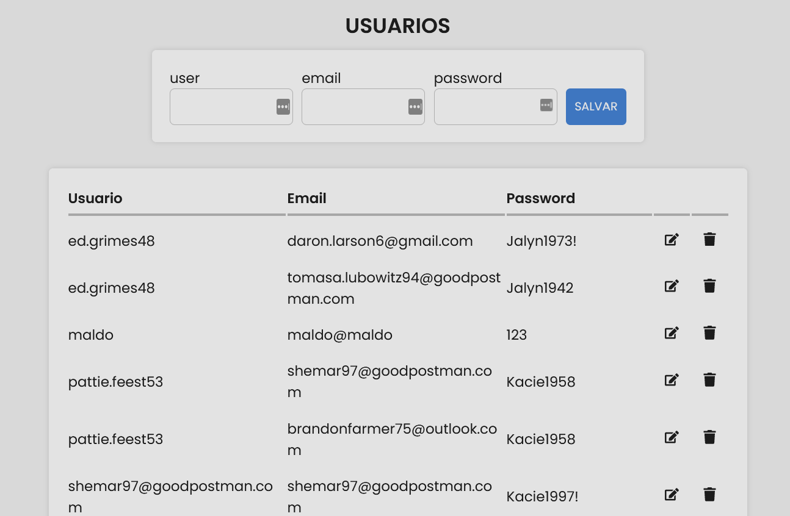
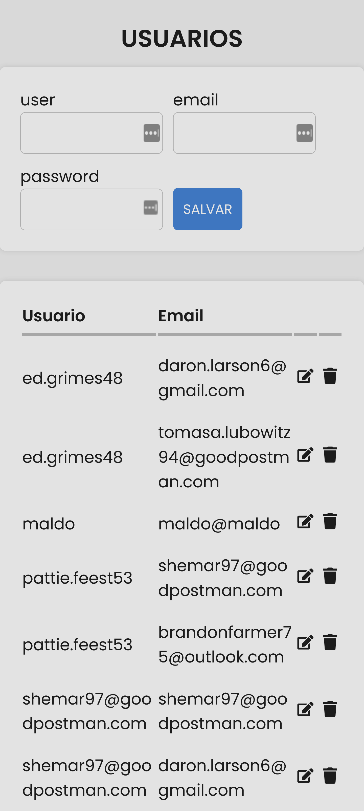

# Nombre del Proyecto 📋

"**Gestión de miembros:** es un sistema que permite crear, leer, actualizar y eliminar usuarios. Es una herramienta útil para cualquier organización que necesite administrar a sus miembros, como un sitio web de membresía, una asociación o un club. 😀

<div style="text-align: center; padding: 10px; display:flex flex-direction:column">
    <h1 style="font-size:25px; text-decoration-line: underline;">Version Escritorio 💻</h1>
    <div style="display:flex; flex-wrap: wrap; gap:5px; justify-content: center;">
    
    </div>
    <h1 style="font-size:25px; text-decoration-line: underline;">Version Mobile 📱</h1>
    <div style="display:flex; flex-wrap: wrap; gap:5px; justify-content: center;">
    
    </div>
    
</div>

# Link Proyecto

<div style="display: flex; flex-direction: column; align-items: center;">
    
    <a style="color: blue; font-size: 20px; display: block; text-align: center;" href="https://userfront-zqie.onrender.com/" target="_blank">Gestión de miembros</a>
</div>

## Instalación ⚙️

1. Asegúrese de tener instalado Node.js en su computadora. Si no lo tiene instalado, puede descargar e instalar **Node.js** en el sitio web oficial de Node.js.

2. Descargar o clonar el repositorio del proyecto desde GitHub.

3. Abrir una terminal o línea de comandos en la carpeta raíz del proyecto.

4. Ejecutar el comando npm install para instalar todas las dependencias necesarias del proyecto, incluyendo:

   -  <a href="https://www.npmjs.com/package/axios">axios</a>
   -  <a href="https://www.npmjs.com/package/react">react</a>
   -  <a href="https://www.npmjs.com/package/react-dom">react-dom</a>
   -  <a href="https://www.npmjs.com/package/react-icons">react-icons</a>
   -  <a href="https://www.npmjs.com/package/react-toastify">react-toastify</a>
   -  <a href="https://www.npmjs.com/package/styled-components">styled-components</a>
   -  <a href="https://www.npmjs.com/package/web-vitals">web-vitals</a>

   ```
   npm install
   ```

   Este comando creará un archivo package.json en la carpeta de su proyecto. Este archivo contendrá información sobre su proyecto y las dependencias que se instalarán.

5. **"A tener en cuenta":** debes seguir los pasos de instalación del backend para configurar las rutas correspondientes en tu proyecto de React para hacer solicitudes al servidor. Además, es importante tener en cuenta que la configuración del backend esta alojada **en la rama "[backend](https://github.com/Willydmq/userList/tree/Backend)" de este proyecto** para poder acceder a ella y poder conectarla al proyecto de React.

6. Una vez completados los pasos anteriores, ejecutar el comando npm start para iniciar la aplicación en el entorno de desarrollo.
   ```
   npm start
   ```
7. Acceder a la URL http://localhost:3000 en un navegador web para ver la aplicación en funcionamiento.

### Requisitos 📄

1. Conocimientos: en CSS, **JavaScript y ReactJS**.

2. Conocimientos de Git: La aplicación utiliza Git para el control de versiones, por lo que necesitará conocimientos básicos de Git para clonar el repositorio del proyecto, crear ramas, fusionar cambios y enviar solicitudes de extracción.

## Uso 💪

La App puede ser una herramienta muy útil para organizar y administrar a tus miembros. Puede ayudarte a mantener la información de tus miembros actualizada y segura, y a proporcionar una experiencia de usuario fluida para tus miembros.

## Construido con 🛠️

<div style="text-align: center; padding: 10px;">
    
</div>

## Deployment 🚀

El patrón de diseño principal para el proyecto de Lista de Vacaciones es la arquitectura basada en componentes de **React**, con enrutamiento basado en componentes y una arquitectura **cliente-servidor** que utiliza solicitudes HTTP para intercambiar datos entre el frontend y el backend.

## Autores ✒️

- **William Maldonado** - _Prueba Técnica -SocialBoil-_ - [Willydmq](https://gitlab.com/Willydmq)

---

⌨️ con ❤️ por [William Maldonado](https://gitlab.com/Willydmq) 😊

---
